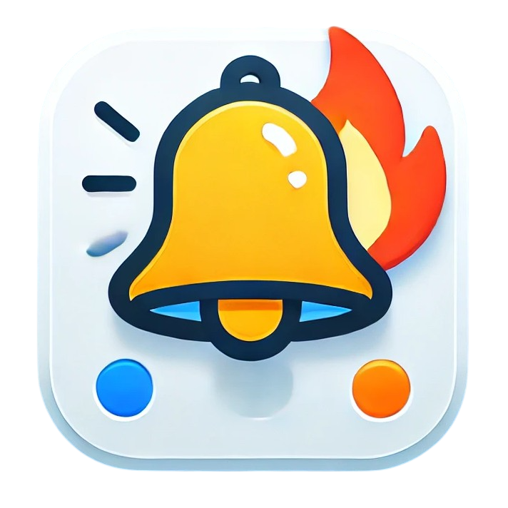
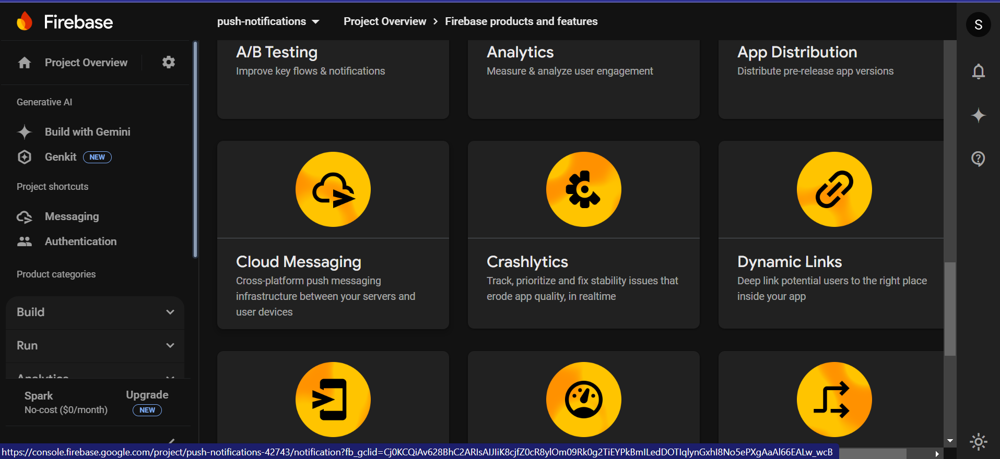
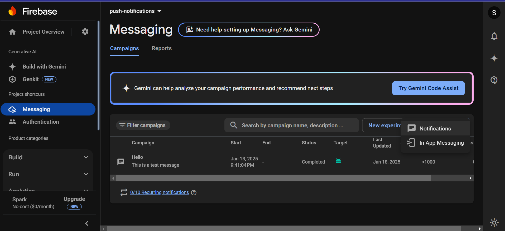
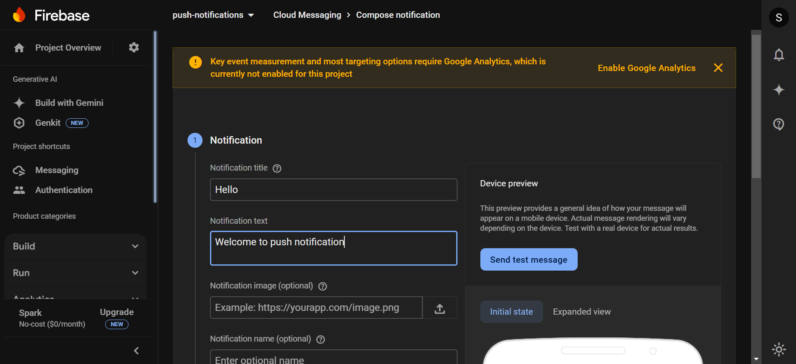
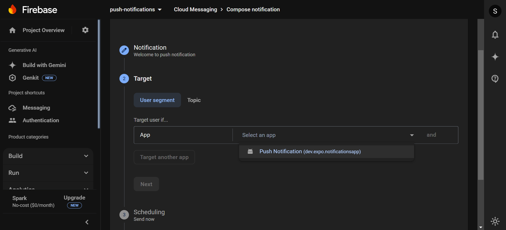
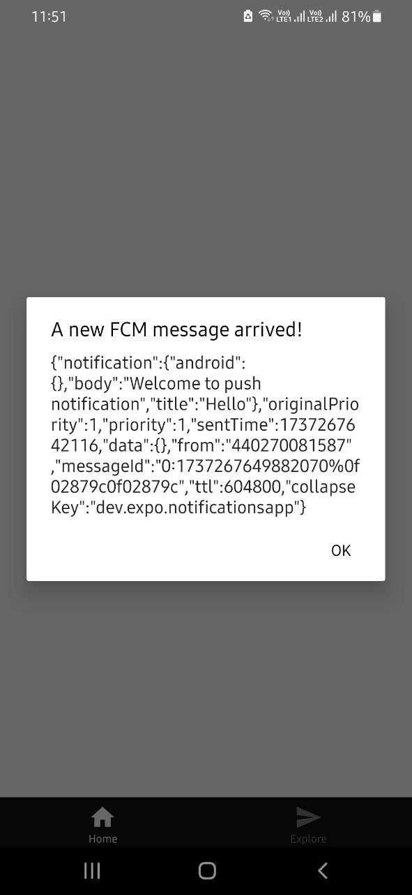
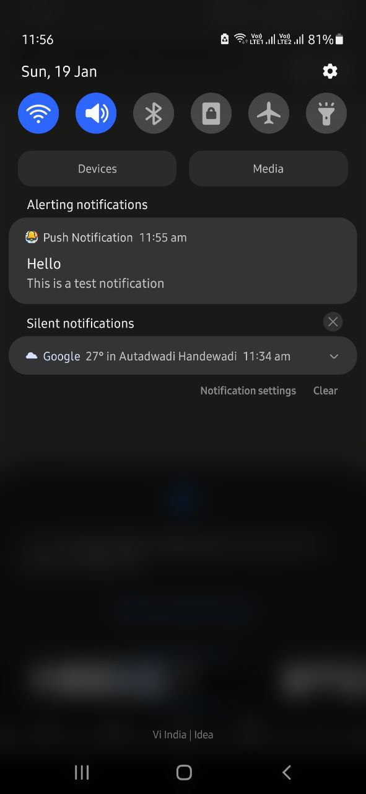

# Push Notification Integration

## Overview
This project demonstrates the integration of push notifications in a mobile application using Firebase Cloud Messaging (FCM). The app allows users to receive notifications both as push notifications and in-app messages.

---

## Steps for Sending Push Notifications

### Step 1: Access Firebase Cloud Messaging
- Go to the [Firebase Console](https://console.firebase.google.com/).
- Click on **Cloud Messaging** 

### Step 2: Create a New Campaign
- Under the **Messaging** section, click on **New Campaign**.
- Select **Notifications** as the notification type.

### Step 3: Generate Notification
- Fill in the **Title** and **Message** for the notification.
- Customize your notification with any additional information if needed.

### Step 4: Select Target App and Submit
- Choose the target app for the notification.
- Review your notification setup, and click **Submit** to send the notification.

---

## Screenshots of Mobile Application

### Push Notification Example
- Example of the received push notification on the mobile screen.

### In-App Notification Example
- Example of the in-app notification that appears within the app.

---

To set up push notifications with your own Firebase and Expo accounts, please refer to the [Expo Push Notification Setup Guide](https://docs.expo.dev/push-notifications/fcm-credentials/).